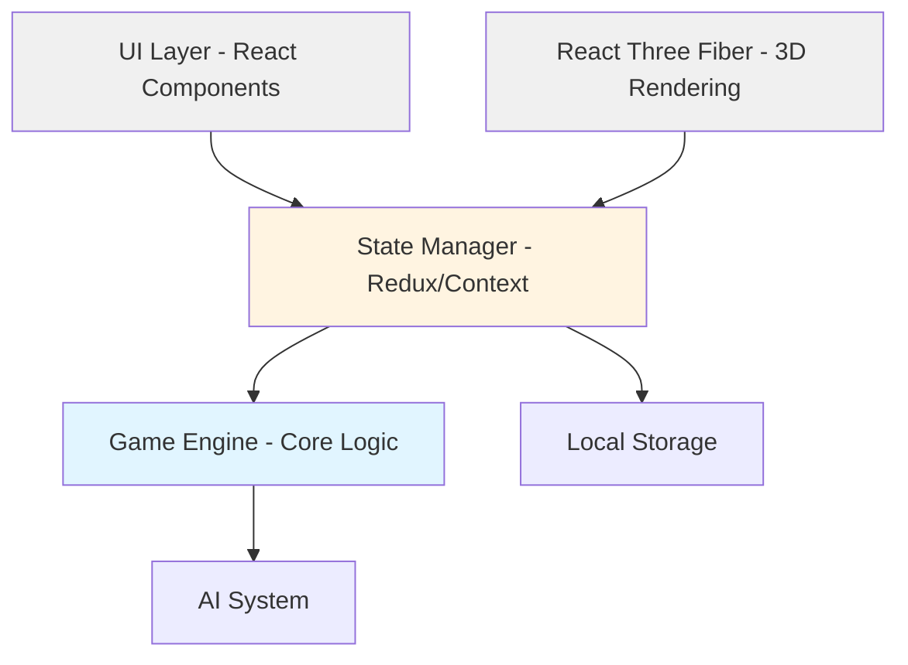

# Design Document: Century Spice Road Online Game

## Overview

This design document outlines the architecture for an online implementation of Century: Spice Road using React and Three.js. The system follows a clean separation between game logic, state management, UI presentation, and 3D rendering. The architecture is designed to support single-player gameplay with AI opponents initially, while maintaining a structure that facilitates future multiplayer implementation.

The application uses React Three Fiber (R3F) as the bridge between React and Three.js, enabling declarative 3D scene management within React's component model. State management follows a unidirectional data flow pattern using React Context and reducers, ensuring predictable state updates and easy serialization for future network synchronization.

## Architecture

### High-Level Architecture



### Layer Responsibilities

**Game Engine Layer**
- Pure game logic with no UI dependencies
- Rule validation and enforcement
- Turn progression and action execution
- Win condition evaluation
- Serializable state representation

**State Management Layer**
- Single source of truth for application state
- Action dispatching and state updates
- State persistence to local storage
- Event emission for UI updates
- Future: Network message handling

**UI Layer (React)**
- User input handling
- 2D UI components (buttons, panels, HUD)
- Layout and responsive design
- Touch and mouse event handling
- Accessibility features

**Rendering Layer (React Three Fiber)**
- 3D card and spice cube rendering
- Animation system
- Camera management
- Lighting and materials
- Performance optimization

**AI System**
- Decision-making algorithms
- Action evaluation and selection
- Difficulty levels (future)
- Turn execution timing

## Components and Interfaces

### Core Game Engine

```typescript
interface GameState {
  players: Player[]
  currentPlayerIndex: number
  merchantCardRow: MerchantCard[]
  merchantDeck: MerchantCard[]
  pointCardRow: PointCard[]
  pointDeck: PointCard[]
  goldCoins: number
  silverCoins: number
  coinPositions: { gold: boolean; silver: boolean }
  gamePhase: 'setup' | 'playing' | 'ended'
  winner: number | null
  turnNumber: number
}

interface Player {
  id: string
  name: string
  isAI: boolean
  caravan: SpiceCollection
  hand: MerchantCard[]
  playedCards: MerchantCard[]
  pointCards: PointCard[]
  coins: { gold: number; silver: number }
  score: number
  statistics: PlayerStatistics
}

interface PlayerStatistics {
  cubesGained: SpiceCollection
  cubesSpent: SpiceCollection
  merchantCardsPlayed: number
  merchantCardsAcquired: number
  restActionsTaken: number
  cardUsageCount: Map<string, number>  // cardId -> usage count
  pointProgression: { turn: number; points: number }[]
  turnTimings: number[]  // milliseconds per turn
  turnStartTime: number | null
}

interface SpiceCollection {
  yellow: number  // Turmeric
  red: number     // Saffron
  green: number   // Cardamom
  brown: number   // Cinnamon
}

interface MerchantCard {
  id: string
  type: 'spice' | 'conversion' | 'exchange'
  effect: SpiceEffect | ConversionEffect | ExchangeEffect
  imageUrl: string
}

interface PointCard {
  id: string
  requiredSpices: SpiceCollection
  points: number
  imageUrl: string
}

interface GameAction {
  type: 'PLAY_CARD' | 'ACQUIRE_CARD' | 'REST' | 'CLAIM_POINT_CARD'
  playerId: string
  payload: any
}
```

### Game Engine API

```typescript
class GameEngine {
  // Initialize new game
  static createGame(playerCount: number, aiCount: number): GameState
  
  // Validate and execute actions
  static validateAction(state: GameState, action: GameAction): boolean
  static executeAction(state: GameState, action: GameAction): GameState
  
  // Query game state
  static getAvailableActions(state: GameState, playerId: string): GameAction[]
  static isGameOver(state: GameState): boolean
  static calculateFinalScores(state: GameState): Player[]
  
  // Serialization
  static serializeState(state: GameState): string
  static deserializeState(json: string): GameState
}
```

### State Management

```typescript
// Action types
type StateAction =
  | { type: 'INIT_GAME'; payload: { playerCount: number; aiCount: number } }
  | { type: 'EXECUTE_GAME_ACTION'; payload: GameAction }
  | { type: 'END_TURN' }
  | { type: 'LOAD_GAME'; payload: GameState }
  | { type: 'SAVE_GAME' }
  | { type: 'BEGIN_ACTION'; payload: { actionType: string } }
  | { type: 'CANCEL_ACTION' }
  | { type: 'COMMIT_ACTION'; payload: GameAction }

// Context provider
interface GameContextValue {
  state: GameState
  dispatch: (action: StateAction) => void
  currentPlayer: Player
  isHumanTurn: boolean
  actionInProgress: boolean
  stateSnapshot: GameState | null
}

// Reducer
function gameReducer(state: GameState, action: StateAction): GameState {
  switch (action.type) {
    case 'BEGIN_ACTION':
      // Create snapshot of current state
      return { ...state, stateSnapshot: deepClone(state) }
    case 'CANCEL_ACTION':
      // Restore from snapshot
      return state.stateSnapshot || state
    case 'COMMIT_ACTION':
      // Execute action and clear snapshot
      const newState = GameEngine.executeAction(state, action.payload)
      return { ...newState, stateSnapshot: null }
    case 'EXECUTE_GAME_ACTION':
      return GameEngine.executeAction(state, action.payload)
    // ... other cases
  }
}
```

### UI Components Structure

```
App
├── GameProvider (Context)
├── GameContainer
│   ├── HamburgerMenu
│   │   ├── MenuButton (top right)
│   │   └── MenuOverlay
│   │       ├── CloseButton (X icon)
│   │       ├── GameRulesOption
│   │       └── RestartGameOption
│   ├── GameBoard3D (R3F Canvas)
│   │   ├── Scene
│   │   ├── Camera
│   │   ├── Lighting
│   │   ├── MerchantCardRow3D
│   │   ├── PointCardRow3D
│   │   ├── PlayerCaravan3D
│   │   └── AnimationController
│   ├── UIOverlay
│   │   ├── PlayerHand
│   │   │   ├── HandToggleButton
│   │   │   └── CardList
│   │   ├── OpponentPanel (collapsible, right side)
│   │   │   ├── OpponentCard (per opponent)
│   │   │   │   ├── PlayerName
│   │   │   │   ├── CaravanDisplay (spice cubes)
│   │   │   │   ├── ScoreDisplay
│   │   │   │   ├── CoinsDisplay (gold + silver)
│   │   │   │   ├── CardCountsDisplay
│   │   │   │   │   ├── HandSizeSymbol (with count)
│   │   │   │   │   ├── PlayedCardsSymbol (with count, clickable)
│   │   │   │   │   └── PointCardsSymbol (with count)
│   │   │   │   └── PlayedCardsOverlay (on hover/click)
│   │   │   │       └── CardGrid (all played cards)
│   │   ├── TurnIndicator
│   │   ├── ActionButtons
│   │   ├── ScoreDisplay
│   │   └── MenuButton
│   └── MobileOrientationHandler
├── MainMenu
│   ├── NewGameDialog
│   └── LoadGameDialog
└── EndGameScreen
    ├── FinalScoresPanel
    └── StatisticsPanel
        ├── BarGraphs (items 1-8)
        ├── MostUsedCards (item 9)
        └── PointProgressionGraph (item 10)
```

### React Three Fiber Components

```typescript
// Caravan Grid Visualization Component
interface CaravanGridProps {
  caravan: SpiceCollection
  maxCapacity?: number
}

function CaravanGrid({ caravan, maxCapacity = 10 }: CaravanGridProps) {
  // Convert spice collection to ordered array
  const spiceArray = useMemo(() => {
    const spices: ('yellow' | 'red' | 'green' | 'brown' | null)[] = []
    
    // Add spices in ascending value order: Y, R, G, B
    for (let i = 0; i < caravan.yellow; i++) spices.push('yellow')
    for (let i = 0; i < caravan.red; i++) spices.push('red')
    for (let i = 0; i < caravan.green; i++) spices.push('green')
    for (let i = 0; i < caravan.brown; i++) spices.push('brown')
    
    // Fill remaining slots with null (empty boxes)
    while (spices.length < maxCapacity) {
      spices.push(null)
    }
    
    return spices
  }, [caravan, maxCapacity])
  
  return (
    <div className="caravan-grid">
      {spiceArray.map((spice, index) => (
        <div
          key={index}
          className={`caravan-box ${spice ? 'filled' : 'empty'}`}
          data-spice={spice}
          style={{
            backgroundColor: spice ? SPICE_COLORS[spice] : 'transparent',
            border: `2px solid ${spice ? SPICE_COLORS[spice] : '#ccc'}`
          }}
        />
      ))}
    </div>
  )
}

// CSS for caravan grid
/*
.caravan-grid {
  display: grid;
  grid-template-columns: repeat(5, 1fr);
  grid-template-rows: repeat(2, 1fr);
  gap: 4px;
  width: fit-content;
}

.caravan-box {
  width: 32px;
  height: 32px;
  border-radius: 4px;
  transition: all 0.2s ease;
}

.caravan-box.filled {
  box-shadow: inset 0 2px 4px rgba(0, 0, 0, 0.2);
}

.caravan-box.empty {
  background: rgba(255, 255, 255, 0.1);
}

@media (max-width: 768px) {
  .caravan-box {
    width: 24px;
    height: 24px;
  }
}
*/

const SPICE_COLORS = {
  yellow: '#FFD700',  // Gold
  red: '#DC143C',     // Crimson
  green: '#228B22',   // Forest Green
  brown: '#8B4513'    // Saddle Brown
}

// Opponent Panel Component with Layout Adjustment
interface OpponentPanelProps {
  opponents: Player[]
  isCollapsed: boolean
  onToggle: () => void
  onLayoutChange: (panelWidth: number) => void
}

function OpponentPanel({ opponents, isCollapsed, onToggle, onLayoutChange }: OpponentPanelProps) {
  const panelRef = useRef<HTMLDivElement>(null)
  
  useEffect(() => {
    // Notify parent of panel width change for game board adjustment
    if (panelRef.current) {
      const width = isCollapsed ? 0 : panelRef.current.offsetWidth
      onLayoutChange(width)
    }
  }, [isCollapsed, onLayoutChange])
  
  return (
    <div 
      ref={panelRef}
      className={`opponent-panel ${isCollapsed ? 'collapsed' : 'expanded'}`}
    >
      <button onClick={onToggle}>
        {isCollapsed ? '→' : '←'}
      </button>
      {!isCollapsed && opponents.map(opponent => (
        <OpponentCard key={opponent.id} player={opponent} />
      ))}
    </div>
  )
}

// Game Board Container with Dynamic Positioning
interface GameBoardContainerProps {
  opponentPanelWidth: number
  children: React.ReactNode
}

function GameBoardContainer({ opponentPanelWidth, children }: GameBoardContainerProps) {
  // Calculate offset to shift board left when panel opens
  const boardOffset = opponentPanelWidth > 0 ? -opponentPanelWidth / 2 : 0
  
  return (
    <div 
      className="game-board-container"
      style={{
        transform: `translateX(${boardOffset}px)`,
        transition: 'transform 0.3s ease-in-out'
      }}
    >
      {children}
    </div>
  )
}

interface OpponentCardProps {
  player: Player
}

function OpponentCard({ player }: OpponentCardProps) {
  const [showPlayedCards, setShowPlayedCards] = useState(false)
  
  return (
    <div className="opponent-card">
      <h3>{player.name}</h3>
      
      {/* Caravan Display with Grid Visualization */}
      <CaravanGrid caravan={player.caravan} />
      
      {/* Score */}
      <div className="score">Score: {player.score}</div>
      
      {/* Coins */}
      <div className="coins">
        <span>🪙 {player.coins.gold}</span>
        <span>🥈 {player.coins.silver}</span>
      </div>
      
      {/* Card Counts with Symbols */}
      <div className="card-counts">
        <div className="count-item" title="Cards in hand">
          <span className="symbol">🃏</span>
          <span className="count">{player.hand.length}</span>
        </div>
        
        <div 
          className="count-item clickable" 
          title="Played merchant cards"
          onMouseEnter={() => setShowPlayedCards(true)}
          onMouseLeave={() => setShowPlayedCards(false)}
          onClick={() => setShowPlayedCards(!showPlayedCards)}
        >
          <span className="symbol">📋</span>
          <span className="count">{player.playedCards.length}</span>
        </div>
        
        <div className="count-item" title="Point cards claimed">
          <span className="symbol">⭐</span>
          <span className="count">{player.pointCards.length}</span>
        </div>
      </div>
      
      {/* Played Cards Overlay */}
      {showPlayedCards && player.playedCards.length > 0 && (
        <PlayedCardsOverlay 
          cards={player.playedCards}
          onClose={() => setShowPlayedCards(false)}
        />
      )}
    </div>
  )
}

interface PlayedCardsOverlayProps {
  cards: MerchantCard[]
  onClose: () => void
}

function PlayedCardsOverlay({ cards, onClose }: PlayedCardsOverlayProps) {
  return (
    <div className="played-cards-overlay">
      <div className="overlay-header">
        <h4>Played Merchant Cards</h4>
        <button onClick={onClose}>✕</button>
      </div>
      <div className="card-effects-list">
        {cards.map((card, index) => (
          <div key={`${card.id}-${index}`} className="card-effect-box">
            {formatCardEffect(card)}
          </div>
        ))}
      </div>
    </div>
  )
}

// Helper function to format card effects as text
function formatCardEffect(card: MerchantCard): string {
  switch (card.type) {
    case 'spice':
      const effect = card.effect as SpiceEffect
      const spices = []
      if (effect.spices.yellow > 0) spices.push('Y'.repeat(effect.spices.yellow))
      if (effect.spices.red > 0) spices.push('R'.repeat(effect.spices.red))
      if (effect.spices.green > 0) spices.push('G'.repeat(effect.spices.green))
      if (effect.spices.brown > 0) spices.push('B'.repeat(effect.spices.brown))
      return spices.join(' ')
      
    case 'conversion':
      const conversion = card.effect as ConversionEffect
      return '↑'.repeat(conversion.upgrades)
      
    case 'exchange':
      const exchange = card.effect as ExchangeEffect
      const input = []
      const output = []
      
      if (exchange.input.yellow > 0) input.push('Y'.repeat(exchange.input.yellow))
      if (exchange.input.red > 0) input.push('R'.repeat(exchange.input.red))
      if (exchange.input.green > 0) input.push('G'.repeat(exchange.input.green))
      if (exchange.input.brown > 0) input.push('B'.repeat(exchange.input.brown))
      
      if (exchange.output.yellow > 0) output.push('Y'.repeat(exchange.output.yellow))
      if (exchange.output.red > 0) output.push('R'.repeat(exchange.output.red))
      if (exchange.output.green > 0) output.push('G'.repeat(exchange.output.green))
      if (exchange.output.brown > 0) output.push('B'.repeat(exchange.output.brown))
      
      return `${input.join('')} → ${output.join('')}`
      
    default:
      return 'Unknown'
  }
}

// CSS for multi-column layout (responsive)
/*
.card-effects-list {
  display: grid;
  grid-template-columns: repeat(auto-fill, minmax(150px, 1fr));
  gap: 8px;
  max-height: 70vh;
  overflow-y: auto;
  padding: 16px;
}

.card-effect-box {
  border: 1px solid #ccc;
  border-radius: 4px;
  padding: 8px 12px;
  background: #f9f9f9;
  font-family: monospace;
  font-size: 14px;
  text-align: center;
  white-space: nowrap;
}

@media (max-width: 768px) {
  .card-effects-list {
    grid-template-columns: repeat(auto-fill, minmax(120px, 1fr));
  }
}
*/

// 3D Card component
interface Card3DProps {
  card: MerchantCard | PointCard
  position: [number, number, number]
  rotation: [number, number, number]
  onClick?: () => void
  onHover?: (hovered: boolean) => void
  scale?: number
}

function Card3D({ card, position, rotation, onClick, onHover, scale = 1 }: Card3DProps) {
  const meshRef = useRef<THREE.Mesh>(null)
  const [hovered, setHovered] = useState(false)
  
  // Animation spring
  const { scale: animScale } = useSpring({
    scale: hovered ? 1.1 : scale,
    config: { tension: 300, friction: 20 }
  })
  
  return (
    <animated.mesh
      ref={meshRef}
      position={position}
      rotation={rotation}
      scale={animScale}
      onClick={onClick}
      onPointerOver={() => { setHovered(true); onHover?.(true) }}
      onPointerOut={() => { setHovered(false); onHover?.(false) }}
    >
      <planeGeometry args={[2, 3]} />
      <meshStandardMaterial>
        <Texture url={card.imageUrl} />
      </meshStandardMaterial>
    </animated.mesh>
  )
}

// Spice cube component
interface SpiceCube3DProps {
  spiceType: 'yellow' | 'red' | 'green' | 'brown'
  position: [number, number, number]
  animate?: boolean
}

function SpiceCube3D({ spiceType, position, animate }: SpiceCube3DProps) {
  const color = SPICE_COLORS[spiceType]
  
  const { pos } = useSpring({
    pos: position,
    config: { tension: 200, friction: 25 }
  })
  
  return (
    <animated.mesh position={pos}>
      <boxGeometry args={[0.5, 0.5, 0.5]} />
      <meshStandardMaterial color={color} metalness={0.3} roughness={0.7} />
    </animated.mesh>
  )
}
```

## Data Models

### Card Data Structure

```typescript
// Merchant card types
interface SpiceEffect {
  spices: SpiceCollection
}

interface ConversionEffect {
  upgrades: number  // Number of upgrade steps allowed
}

interface ExchangeEffect {
  input: SpiceCollection
  output: SpiceCollection
}

// Card definitions (loaded from JSON)
const MERCHANT_CARDS: MerchantCard[] = [
  {
    id: 'spice_2yellow',
    type: 'spice',
    effect: { spices: { yellow: 2, red: 0, green: 0, brown: 0 } },
    imageUrl: '/assets/cards/spice_2yellow.png'
  },
  {
    id: 'upgrade_2',
    type: 'conversion',
    effect: { upgrades: 2 },
    imageUrl: '/assets/cards/upgrade_2.png'
  },
  {
    id: 'exchange_2y_1r',
    type: 'exchange',
    effect: {
      input: { yellow: 2, red: 0, green: 0, brown: 0 },
      output: { yellow: 0, red: 1, green: 0, brown: 0 }
    },
    imageUrl: '/assets/cards/exchange_2y_1r.png'
  }
  // ... more cards
]

const POINT_CARDS: PointCard[] = [
  {
    id: 'point_1',
    requiredSpices: { yellow: 0, red: 2, green: 1, brown: 0 },
    points: 8,
    imageUrl: '/assets/cards/point_1.png'
  }
  // ... more cards
]
```

### Game Configuration

```typescript
interface GameConfig {
  maxCaravanSize: number
  startingCards: {
    spiceCard: string  // Card ID
    upgradeCard: string  // Card ID
  }
  startingSpices: {
    player1: SpiceCollection
    player2_3: SpiceCollection
    player4_5: SpiceCollection
  }
  coinSetup: {
    goldCount: number
    silverCount: number
  }
  victoryCardThreshold: {
    players2_3: number
    players4_5: number
  }
  merchantRowSize: number
  pointRowSize: number
}

const DEFAULT_CONFIG: GameConfig = {
  maxCaravanSize: 10,
  startingCards: {
    spiceCard: 'spice_2yellow',
    upgradeCard: 'upgrade_2'
  },
  startingSpices: {
    player1: { yellow: 3, red: 0, green: 0, brown: 0 },
    player2_3: { yellow: 4, red: 0, green: 0, brown: 0 },
    player4_5: { yellow: 4, red: 1, green: 0, brown: 0 }
  },
  coinSetup: {
    goldCount: 5,
    silverCount: 10
  },
  victoryCardThreshold: {
    players2_3: 5,
    players4_5: 6
  },
  merchantRowSize: 6,
  pointRowSize: 5
}
```

## Correctness Properties

*A property is a characteristic or behavior that should hold true across all valid executions of a system—essentially, a formal statement about what the system should do. Properties serve as the bridge between human-readable specifications and machine-verifiable correctness guarantees.*

### Property 1: Game Initialization Creates Valid Setup

*For any* new game initialization with valid player count, the resulting game state should have exactly 5 face-up point cards, exactly 6 face-up merchant cards, non-empty decks for both card types, and all players with valid starting hands and caravans.

**Validates: Requirements 1.1, 1.4, 1.5**

### Property 2: Turn Actions Are Mutually Exclusive

*For any* game state where it is a player's turn, exactly one action type (play card, acquire card, rest, or claim point card) can be executed per turn.

**Validates: Requirements 2.1**

### Property 3: Spice Card Effects Are Additive

*For any* spice card and any player caravan state, playing the spice card should increase the caravan spice counts by exactly the amounts specified on the card.

**Validates: Requirements 2.2, 4.3**

### Property 4: Conversion Follows Value Chain

*For any* conversion card with N upgrades and any caravan with sufficient spices, performing conversions should only upgrade spices along the value chain (yellow→red→green→brown) and allow up to N upgrade steps total.

**Validates: Requirements 2.3**

### Property 5: Exchange Cards Are Repeatable

*For any* exchange card and any caravan state, if the caravan contains K times the input spices, the player should be able to perform the exchange up to K times, each time removing the input spices and adding the output spices.

**Validates: Requirements 2.4**

### Property 6: Acquire Cost Equals Left Position

*For any* merchant card at position P in the row (0-indexed from left), acquiring it should cost exactly P spices (one spice placed on each card to the left), and the acquired card plus any spices on it should be added to the player's hand.

**Validates: Requirements 2.5**

### Property 7: Card Rows Maintain Size

*For any* card acquisition or point card claim, the respective card row should maintain its original size by sliding cards leftward and drawing a new card to the rightmost position.

**Validates: Requirements 2.6, 2.9**

### Property 8: Rest Returns All Played Cards

*For any* player with N played cards, executing the rest action should move all N cards from the played area back to the player's hand, resulting in zero played cards.

**Validates: Requirements 2.7**

### Property 9: Scoring Requires Exact Spices

*For any* point card with required spices S and any player with caravan C, the player can claim the card if and only if C contains at least S of each spice type, and claiming removes exactly S spices from C.

**Validates: Requirements 2.8**

### Property 10: Coin Awards Follow Position Rules

*For any* point card claim, if it's from the first position and gold coins remain, award one gold coin; if from the second position and silver coins remain, award one silver coin; if all gold coins are claimed, silver coins move to first position; if all coins are depleted, award no coins.

**Validates: Requirements 2.10, 2.11, 2.12**

### Property 11: Invalid Actions Preserve State

*For any* game state S and any invalid action A, attempting to execute A should result in rejection and the game state should remain exactly S (no modifications).

**Validates: Requirements 3.2, 3.5**

### Property 12: State Serialization Round-Trip

*For any* valid game state S, serializing S to JSON and then deserializing back should produce a game state equivalent to S (all players, cards, spices, and game phase preserved).

**Validates: Requirements 3.4, 13.1, 13.2, 13.3, 13.4**

### Property 13: Caravan Capacity Enforced

*For any* game state, every player's caravan should contain at most 10 spices total (sum of yellow + red + green + brown ≤ 10).

**Validates: Requirements 4.1**

### Property 14: Excess Spices Trigger Discard

*For any* player turn ending with caravan total > 10, the game should require the player to discard spices until the total equals 10 before the turn can complete.

**Validates: Requirements 4.2**

### Property 15: Spice Supply Is Unlimited

*For any* game state and any action requiring spices from the supply, the action should never fail due to insufficient supply (supply is treated as infinite).

**Validates: Requirements 4.5**

### Property 16: Victory Threshold Triggers End Game

*For any* game with P players, when any player claims their Nth point card (where N=5 for 2-3 players, N=6 for 4-5 players), the game should enter end-game phase and complete the current round before ending.

**Validates: Requirements 5.1**

### Property 17: Final Score Calculation Is Correct

*For any* ended game state, each player's final score should equal the sum of their point card values + (gold coins × 3) + (silver coins × 1) + (red + green + brown spice counts).

**Validates: Requirements 5.2**

### Property 18: Tiebreaker Favors Later Players

*For any* ended game state where two or more players have the same highest score, the winner should be the player with the highest turn order index among the tied players.

**Validates: Requirements 5.3**

### Property 19: AI Actions Are Valid

*For any* game state where it is an AI player's turn, any action chosen by the AI should pass validation (AI never attempts invalid actions).

**Validates: Requirements 6.3**

### Property 20: Action Cancellation Preserves State

*For any* game state S and any action A that is started but cancelled before commitment, the game state after cancellation should be identical to S (no modifications to caravan, hand, or any other state).

**Validates: Requirements 15.1, 15.3, 15.4**

### Property 21: Caravan Grid Displays Correct Spice Order

*For any* valid spice collection C, the caravan grid visualization should display spices in ascending value order (yellow, then red, then green, then brown) filling left-to-right in the top row first, then left-to-right in the bottom row, with exactly (C.yellow + C.red + C.green + C.brown) filled boxes and (10 - total) empty boxes.

**Validates: Requirements 19.1, 19.2, 19.3, 19.4, 19.5**


## Error Handling

### Game Logic Errors

**Invalid Action Handling**
- All game actions are validated before execution
- Invalid actions return error objects with descriptive messages
- State remains unchanged when actions are rejected
- Error types: INSUFFICIENT_RESOURCES, INVALID_CARD, NOT_YOUR_TURN, CARAVAN_FULL, INVALID_GAME_PHASE

**State Validation**
- Game state is validated after every mutation
- Invariants are checked (caravan limits, card counts, turn order)
- If validation fails, the previous state is restored
- Validation errors are logged for debugging

### UI/UX Error Handling

**User Input Errors**
- Disabled UI elements for unavailable actions
- Visual feedback for invalid selections (shake animation, red highlight)
- Toast notifications for error messages
- Contextual help tooltips

**Network Errors (Future)**
- Retry logic for failed requests
- Offline mode detection
- State synchronization conflict resolution
- Graceful degradation

### Rendering Errors

**Three.js Error Handling**
- Fallback to 2D rendering if WebGL is unavailable
- Texture loading error handling with placeholder images
- Performance monitoring and automatic quality adjustment
- Error boundaries to prevent full app crashes

### Data Persistence Errors

**Local Storage Errors**
- Try-catch blocks around all storage operations
- Quota exceeded handling (clear old saves)
- Corrupted data detection and recovery
- Fallback to in-memory state if storage fails

## Testing Strategy

### Dual Testing Approach

This project employs both unit testing and property-based testing to ensure comprehensive coverage:

**Unit Tests** focus on:
- Specific examples demonstrating correct behavior
- Edge cases (empty caravans, full hands, depleted decks)
- Error conditions and validation
- Integration points between components
- UI component rendering and interactions

**Property-Based Tests** focus on:
- Universal properties that hold for all inputs
- Comprehensive input coverage through randomization
- Game rule enforcement across all possible states
- State consistency and invariants

Both testing approaches are complementary and necessary for high confidence in correctness.

### Property-Based Testing Configuration

**Framework**: fast-check (JavaScript/TypeScript property-based testing library)

**Configuration**:
- Minimum 100 iterations per property test
- Custom generators for game entities (cards, spices, game states)
- Shrinking enabled to find minimal failing examples
- Seed-based reproducibility for failed tests

**Test Tagging**:
Each property test must include a comment referencing its design property:
```typescript
// Feature: century-spice-road-game, Property 1: Game Initialization Creates Valid Setup
test('game initialization creates valid setup', () => {
  fc.assert(
    fc.property(fc.integer({ min: 2, max: 5 }), (playerCount) => {
      const state = GameEngine.createGame(playerCount, playerCount - 1)
      expect(state.pointCardRow).toHaveLength(5)
      expect(state.merchantCardRow).toHaveLength(6)
      expect(state.pointDeck.length).toBeGreaterThan(0)
      expect(state.merchantDeck.length).toBeGreaterThan(0)
      // ... more assertions
    }),
    { numRuns: 100 }
  )
})
```

### Unit Testing Strategy

**Game Engine Tests**
- Test each action type with specific examples
- Test edge cases: empty decks, full caravans, no valid actions
- Test game initialization with different player counts
- Test score calculation with various end states
- Test serialization/deserialization

**State Management Tests**
- Test reducer with each action type
- Test state persistence and loading
- Test action validation
- Test state immutability

**UI Component Tests**
- Test component rendering with various props
- Test user interactions (clicks, hovers, drags)
- Test responsive behavior at different screen sizes
- Test accessibility features

**Integration Tests**
- Test complete game flows (setup → play → end)
- Test AI turn execution
- Test card acquisition and playing sequences
- Test scoring and victory conditions

### Test Organization

```
src/
├── engine/
│   ├── GameEngine.ts
│   ├── GameEngine.test.ts
│   └── GameEngine.property.test.ts
├── state/
│   ├── gameReducer.ts
│   ├── gameReducer.test.ts
│   └── gameReducer.property.test.ts
├── components/
│   ├── PlayerHand.tsx
│   └── PlayerHand.test.tsx
└── __tests__/
    └── integration/
        └── fullGame.test.ts
```

### Custom Generators for Property Tests

```typescript
// Generator for valid spice collections
const spiceCollectionArb = fc.record({
  yellow: fc.integer({ min: 0, max: 10 }),
  red: fc.integer({ min: 0, max: 10 }),
  green: fc.integer({ min: 0, max: 10 }),
  brown: fc.integer({ min: 0, max: 10 })
}).filter(spices => 
  spices.yellow + spices.red + spices.green + spices.brown <= 10
)

// Generator for merchant cards
const merchantCardArb = fc.oneof(
  spiceCardArb,
  conversionCardArb,
  exchangeCardArb
)

// Generator for valid game states
const gameStateArb = fc.record({
  players: fc.array(playerArb, { minLength: 2, maxLength: 5 }),
  currentPlayerIndex: fc.integer({ min: 0, max: 4 }),
  merchantCardRow: fc.array(merchantCardArb, { minLength: 6, maxLength: 6 }),
  // ... more fields
}).filter(state => isValidGameState(state))
```

## Mobile Orientation Handling

### Multi-Step Action Flow

**Action Commitment Pattern**

Multi-step actions (conversion, exchange, discard) follow a three-phase pattern:

1. **Begin Phase**: User selects an action → System creates state snapshot → UI shows decision dialog
2. **Decision Phase**: User makes choices (which spices to convert, how many exchanges, etc.) → Changes are previewed but not committed
3. **Commit/Cancel Phase**: 
   - User clicks "Confirm" → System commits changes and clears snapshot
   - User clicks "Cancel" → System restores from snapshot, no changes applied

**Implementation**
```typescript
// When user clicks a conversion card
function handleConversionCardClick(card: MerchantCard) {
  dispatch({ type: 'BEGIN_ACTION', payload: { actionType: 'CONVERSION' } })
  showConversionDialog(card)
}

// In conversion dialog
function ConversionDialog({ card, onConfirm, onCancel }) {
  const [conversions, setConversions] = useState([])
  
  return (
    <Dialog>
      <ConversionSelector 
        card={card}
        conversions={conversions}
        onChange={setConversions}
      />
      <Button onClick={() => {
        dispatch({ type: 'COMMIT_ACTION', payload: { 
          type: 'PLAY_CARD',
          cardId: card.id,
          conversions 
        }})
        onConfirm()
      }}>Confirm</Button>
      <Button onClick={() => {
        dispatch({ type: 'CANCEL_ACTION' })
        onCancel()
      }}>Cancel</Button>
    </Dialog>
  )
}
```

### Landscape Mode Enforcement

**Detection and Prompting**
- Detect mobile devices using user agent and screen size
- Display orientation prompt on portrait mode
- Show "Start Game" button that triggers fullscreen + landscape lock

**Implementation**
```typescript
function MobileOrientationHandler() {
  const [isLandscape, setIsLandscape] = useState(false)
  const [isMobile, setIsMobile] = useState(false)
  
  useEffect(() => {
    const checkOrientation = () => {
      setIsLandscape(window.innerWidth > window.innerHeight)
      setIsMobile(/iPhone|iPad|iPod|Android/i.test(navigator.userAgent))
    }
    
    checkOrientation()
    window.addEventListener('resize', checkOrientation)
    return () => window.removeEventListener('resize', checkOrientation)
  }, [])
  
  const enterFullscreenLandscape = async () => {
    try {
      // Request fullscreen
      await document.documentElement.requestFullscreen()
      
      // Lock orientation to landscape
      if (screen.orientation && screen.orientation.lock) {
        await screen.orientation.lock('landscape')
      }
    } catch (error) {
      console.warn('Fullscreen/orientation lock failed:', error)
    }
  }
  
  if (isMobile && !isLandscape) {
    return (
      <div className="orientation-prompt">
        <p>Please rotate your device to landscape mode</p>
        <button onClick={enterFullscreenLandscape}>
          Start Game (Fullscreen)
        </button>
      </div>
    )
  }
  
  return <GameContainer />
}
```

### Responsive Layout Adjustments

**Breakpoints**
- Mobile landscape: 568px - 926px width
- Tablet landscape: 927px - 1366px width
- Desktop: 1367px+ width

**Layout Adaptations**
- Mobile: Smaller card sizes, compact UI, simplified animations
- Tablet: Medium card sizes, full UI features
- Desktop: Large card sizes, enhanced visual effects

## AI System Design

### Decision-Making Algorithm

**Strategy Phases**
1. **Evaluate Point Cards**: Identify achievable point cards based on current caravan
2. **Plan Resource Path**: Determine which merchant cards are needed to reach target spices
3. **Action Selection**: Choose action that progresses toward goal
4. **Opportunistic Scoring**: Claim point cards when requirements are met

**Action Evaluation**
```typescript
interface ActionEvaluation {
  action: GameAction
  score: number
  reasoning: string
}

class AIPlayer {
  evaluateActions(state: GameState, playerId: string): ActionEvaluation[] {
    const availableActions = GameEngine.getAvailableActions(state, playerId)
    return availableActions.map(action => ({
      action,
      score: this.scoreAction(state, action, playerId),
      reasoning: this.explainAction(action)
    }))
  }
  
  scoreAction(state: GameState, action: GameAction, playerId: string): number {
    // Scoring factors:
    // - Progress toward claimable point cards (+high)
    // - Acquiring valuable merchant cards (+medium)
    // - Efficient spice conversion (+medium)
    // - Avoiding caravan overflow (+low)
    // - Blocking opponents (future) (+low)
  }
  
  selectBestAction(evaluations: ActionEvaluation[]): GameAction {
    return evaluations.sort((a, b) => b.score - a.score)[0].action
  }
}
```

### Difficulty Levels (Future Enhancement)

**Easy**: Random valid actions
**Medium**: Basic strategy (current implementation)
**Hard**: Advanced strategy with opponent blocking and card counting

## Performance Optimization

### Statistics Tracking

**Real-Time Data Collection**

The game engine tracks player statistics throughout gameplay for end-game analysis:

```typescript
class StatisticsTracker {
  static recordCubeGain(player: Player, spices: SpiceCollection): void {
    player.statistics.cubesGained.yellow += spices.yellow
    player.statistics.cubesGained.red += spices.red
    player.statistics.cubesGained.green += spices.green
    player.statistics.cubesGained.brown += spices.brown
  }
  
  static recordCubeSpend(player: Player, spices: SpiceCollection): void {
    player.statistics.cubesSpent.yellow += spices.yellow
    player.statistics.cubesSpent.red += spices.red
    player.statistics.cubesSpent.green += spices.green
    player.statistics.cubesSpent.brown += spices.brown
  }
  
  static recordCardPlay(player: Player, cardId: string): void {
    player.statistics.merchantCardsPlayed++
    const count = player.statistics.cardUsageCount.get(cardId) || 0
    player.statistics.cardUsageCount.set(cardId, count + 1)
  }
  
  static recordCardAcquisition(player: Player): void {
    player.statistics.merchantCardsAcquired++
  }
  
  static recordRest(player: Player): void {
    player.statistics.restActionsTaken++
  }
  
  static startTurn(player: Player): void {
    player.statistics.turnStartTime = Date.now()
  }
  
  static endTurn(player: Player, turnNumber: number): void {
    if (player.statistics.turnStartTime) {
      const duration = Date.now() - player.statistics.turnStartTime
      player.statistics.turnTimings.push(duration)
      player.statistics.turnStartTime = null
    }
    
    // Record point progression
    player.statistics.pointProgression.push({
      turn: turnNumber,
      points: player.score
    })
  }
  
  static calculateEfficiency(player: Player): number {
    const totalSpent = player.statistics.cubesSpent.yellow +
                      player.statistics.cubesSpent.red +
                      player.statistics.cubesSpent.green +
                      player.statistics.cubesSpent.brown
    return totalSpent > 0 ? player.score / totalSpent : 0
  }
  
  static calculateAverageValuePerTurn(player: Player): number {
    const turns = player.statistics.pointProgression.length
    return turns > 0 ? player.score / turns : 0
  }
  
  static calculateAverageTimePerTurn(player: Player): number {
    const timings = player.statistics.turnTimings
    if (timings.length === 0) return 0
    const sum = timings.reduce((a, b) => a + b, 0)
    return sum / timings.length
  }
  
  static getMostUsedCard(player: Player): string | null {
    let maxCount = 0
    let mostUsedCardId: string | null = null
    
    player.statistics.cardUsageCount.forEach((count, cardId) => {
      if (count > maxCount) {
        maxCount = count
        mostUsedCardId = cardId
      }
    })
    
    return mostUsedCardId
  }
}
```

**End-Game Statistics Display**

Statistics are visualized using a charting library (e.g., Chart.js or Recharts):

- **Bar Graphs**: Cube gains/spends, card plays, acquisitions, rests, efficiency, average value/time
- **Card Display**: Most used card shown with card image
- **Line Graph**: Point progression over turns with multiple lines (one per player)

### Rendering Optimization

**Three.js Performance**
- Object pooling for spice cubes (reuse meshes)
- Level of detail (LOD) for distant objects
- Frustum culling for off-screen objects
- Texture atlasing to reduce draw calls
- Instanced rendering for multiple identical objects

**React Optimization**
- Memoization of expensive computations (React.memo, useMemo)
- Virtual scrolling for large card lists
- Lazy loading of 3D assets
- Code splitting for route-based chunks

### State Management Optimization

**Immutability Patterns**
- Use Immer for efficient immutable updates
- Structural sharing to minimize memory allocation
- Selective re-rendering with React Context splitting

**Caching**
- Memoize available actions calculation
- Cache AI decision evaluations
- Precompute card combinations

## Future Multiplayer Architecture

### Network Layer Design

**WebSocket Communication**
```typescript
interface NetworkMessage {
  type: 'GAME_ACTION' | 'STATE_SYNC' | 'PLAYER_JOIN' | 'PLAYER_LEAVE'
  payload: any
  timestamp: number
  senderId: string
}

class NetworkManager {
  private socket: WebSocket
  private gameId: string
  
  sendAction(action: GameAction): void {
    this.socket.send(JSON.stringify({
      type: 'GAME_ACTION',
      payload: action,
      timestamp: Date.now(),
      senderId: this.playerId
    }))
  }
  
  onMessage(handler: (message: NetworkMessage) => void): void {
    this.socket.onmessage = (event) => {
      const message = JSON.parse(event.data)
      handler(message)
    }
  }
}
```

**Game Room Management**
- Server maintains game rooms with unique codes
- Players join via 6-character room codes
- Host can start game when all players ready
- Automatic reconnection handling

**State Synchronization**
- Server is authoritative for game state
- Clients send actions, server validates and broadcasts
- Optimistic UI updates with rollback on rejection
- Periodic state sync to prevent drift

**Conflict Resolution**
- Turn-based nature prevents most conflicts
- Server timestamp determines action order
- Client-side prediction with server reconciliation

## Deployment Considerations

### Build Configuration

**Production Build**
- Minification and tree-shaking
- Asset optimization (image compression, texture atlasing)
- Code splitting for faster initial load
- Service worker for offline capability

### Hosting

**Static Hosting** (Current)
- Deploy to Vercel, Netlify, or similar
- CDN for global asset delivery
- HTTPS required for fullscreen API

**Future Backend** (Multiplayer)
- Node.js server for WebSocket connections
- Redis for game state caching
- PostgreSQL for persistent game history
- Horizontal scaling with load balancer

### Monitoring

**Performance Monitoring**
- FPS tracking and reporting
- Load time metrics
- Error tracking (Sentry or similar)
- User analytics (game completion rates, average game duration)

**Health Checks**
- API endpoint availability
- WebSocket connection stability
- Database query performance
