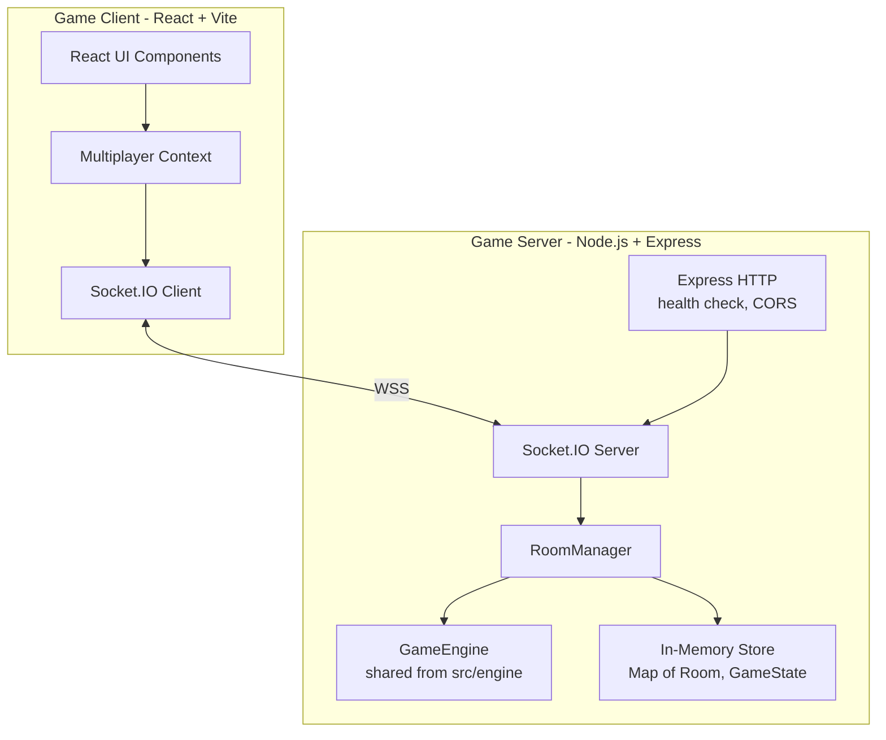
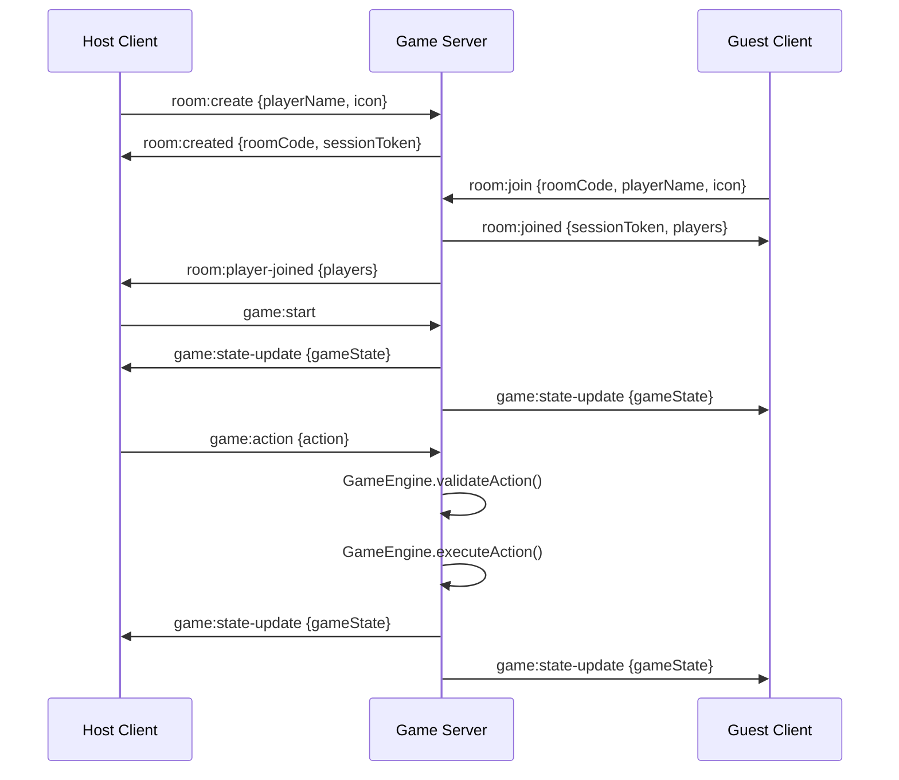

# Design Document: Multiplayer Mode

## Overview

This design adds online multiplayer to the existing Century: Spice Road single-player game. The core insight is that `GameEngine.ts` is already a pure state machine with `validateAction` and `executeAction` static methods — it can be reused directly on a Node.js server with zero duplication of game rules.

The architecture follows a server-authoritative model: the Game_Server runs the GameEngine, validates all moves, and broadcasts state to connected Game_Clients via Socket.IO. Clients send action intents and render the state they receive. Single-player mode remains entirely local and unchanged.

### Key Design Decisions

1. **Reuse GameEngine as-is on the server** — The engine imports from `src/types` and `src/data` with no DOM or React dependencies, making it directly usable in Node.js. The server folder at `/server/` will use TypeScript path aliases or relative imports to reference the shared `src/engine/` and `src/types/` code.

2. **Socket.IO rooms for isolation** — Each multiplayer game maps to a Socket.IO room. Broadcasting state changes uses `io.to(roomCode).emit(...)`, which isolates rooms from each other naturally.

3. **In-memory state with cleanup** — All room and game state lives in a `Map<string, Room>` in server memory. A periodic cleanup job evicts stale rooms (no connected players for 10+ minutes) to prevent memory leaks. No database required.

4. **Session tokens for reconnection** — On join, each player receives a random session token stored in the Room. On reconnect, the client sends this token to reclaim their seat without needing accounts or passwords.

5. **Shared TypeScript code** — The `/server/` folder references the existing `src/engine/GameEngine.ts`, `src/types/`, and `src/data/` via TypeScript project references or path mappings. No code is duplicated.

## Architecture



### Communication Flow



## Components and Interfaces

### Server-Side Components

#### 1. RoomManager

Manages room lifecycle: creation, joining, leaving, cleanup.

```typescript
interface RoomManager {
  createRoom(hostName: string, hostIcon: string): { roomCode: string; sessionToken: string }
  joinRoom(roomCode: string, playerName: string, playerIcon: string): { sessionToken: string }
  leaveRoom(roomCode: string, sessionToken: string): void
  reconnect(roomCode: string, sessionToken: string): Room | null
  getRoom(roomCode: string): Room | undefined
  cleanupStaleRooms(): void
}
```

- Generates unique 6-character uppercase alphanumeric room codes
- Enforces max concurrent rooms limit (configurable, default 50)
- Enforces max 5 players per room
- Maps session tokens to player seats for reconnection
- Runs cleanup on a 60-second interval

#### 2. GameController

Handles game lifecycle events: start, action processing, turn advancement, end detection.

```typescript
interface GameController {
  startGame(room: Room): GameState
  processAction(room: Room, sessionToken: string, action: GameAction): GameState
  handleDisconnect(room: Room, sessionToken: string): void
  handleReconnect(room: Room, sessionToken: string): GameState
}
```

- Delegates to `GameEngine.createGame()` for initialization
- Delegates to `GameEngine.validateAction()` and `GameEngine.executeAction()` for moves
- Delegates to `GameEngine.isGameOver()` and `GameEngine.calculateFinalScores()` for end detection
- Manages turn timer and disconnection pause logic

#### 3. SocketHandler

Wires Socket.IO events to RoomManager and GameController methods.

```typescript
interface SocketHandler {
  registerEvents(socket: Socket): void
}
```

Event mapping:
| Client Event | Server Handler | Server Broadcast |
|---|---|---|
| `room:create` | `RoomManager.createRoom` | `room:created` to sender |
| `room:join` | `RoomManager.joinRoom` | `room:player-joined` to room |
| `room:leave` | `RoomManager.leaveRoom` | `room:player-left` to room |
| `game:start` | `GameController.startGame` | `game:state-update` to room |
| `game:action` | `GameController.processAction` | `game:state-update` to room |
| `disconnect` | `GameController.handleDisconnect` | `room:player-disconnected` to room |
| `room:reconnect` | `GameController.handleReconnect` | `room:player-reconnected` to room |

### Client-Side Components

#### 4. MultiplayerContext

A React context that manages the Socket.IO connection and multiplayer state, analogous to the existing `GameContext` for single-player.

```typescript
interface MultiplayerContextValue {
  // Connection
  socket: Socket | null
  connected: boolean
  
  // Room state
  roomCode: string | null
  players: LobbyPlayer[]
  isHost: boolean
  sessionToken: string | null
  
  // Game state (received from server)
  gameState: GameState | null
  myPlayerIndex: number | null
  isMyTurn: boolean
  
  // Actions
  createRoom: (playerName: string, icon: string) => void
  joinRoom: (roomCode: string, playerName: string, icon: string) => void
  leaveRoom: () => void
  startGame: () => void
  sendAction: (action: GameAction) => void
  
  // Status
  error: string | null
  disconnectedPlayers: string[]
}
```

#### 5. UI Components (New)

| Component | Purpose |
|---|---|
| `MultiplayerMenu` | Entry point: Create Room / Join Room buttons |
| `ProfileSetup` | Name input + icon picker before joining |
| `Lobby` | Shows players, room code, invite link, start button |
| `MultiplayerGameBoard` | Wraps existing game board, reads from MultiplayerContext instead of GameContext |

The existing `GameBoardContainer`, `CaravanGrid`, `MerchantCardRow`, `PointCardRow`, `OpponentPanel`, and action components remain unchanged — they render based on `GameState` and a "is my turn" flag, regardless of whether the state comes from a local reducer or a WebSocket.

## Data Models

### Room (Server-Side)

```typescript
interface Room {
  roomCode: string
  status: 'lobby' | 'playing' | 'completed'
  hostSessionToken: string
  players: RoomPlayer[]
  gameState: GameState | null
  createdAt: number       // timestamp
  lastActivityAt: number  // timestamp, updated on any event
  disconnectedPlayers: Map<string, DisconnectedPlayer>
}

interface RoomPlayer {
  sessionToken: string
  socketId: string | null  // null when disconnected
  name: string
  icon: string
  playerIndex: number      // seat index in GameState.players[]
  joinedAt: number
}

interface DisconnectedPlayer {
  sessionToken: string
  disconnectedAt: number
  reconnectionDeadline: number  // disconnectedAt + RECONNECTION_WINDOW
}
```

### LobbyPlayer (Client-Side, sent over wire)

```typescript
interface LobbyPlayer {
  name: string
  icon: string
  isHost: boolean
  connected: boolean
}
```

### Socket.IO Event Payloads

```typescript
// Client -> Server
interface CreateRoomPayload { playerName: string; icon: string }
interface JoinRoomPayload { roomCode: string; playerName: string; icon: string }
interface ReconnectPayload { roomCode: string; sessionToken: string }
interface GameActionPayload { action: GameAction }

// Server -> Client
interface RoomCreatedPayload { roomCode: string; sessionToken: string; inviteLink: string }
interface RoomJoinedPayload { sessionToken: string; players: LobbyPlayer[] }
interface PlayerJoinedPayload { players: LobbyPlayer[] }
interface PlayerLeftPayload { players: LobbyPlayer[]; leftPlayerName: string }
interface StateUpdatePayload { gameState: GameState; event?: string }
interface GameErrorPayload { message: string }
interface PlayerDisconnectedPayload { playerName: string; reconnectionDeadline: number }
interface PlayerReconnectedPayload { playerName: string }
interface GameOverPayload { finalScores: Array<{ name: string; score: number; breakdown: ScoreBreakdown }> }

interface ScoreBreakdown {
  pointCards: number
  goldCoins: number
  silverCoins: number
  remainingSpices: number
}
```

### Server Configuration (Environment Variables)

```typescript
interface ServerConfig {
  PORT: number                    // default 3001
  ALLOWED_ORIGINS: string[]       // CORS origins, default ['http://localhost:5173']
  RECONNECTION_WINDOW_MS: number  // default 120000 (2 min)
  MAX_ROOMS: number               // default 50
  ROOM_CLEANUP_INTERVAL_MS: number // default 60000
  STALE_ROOM_TIMEOUT_MS: number   // default 600000 (10 min)
}
```

